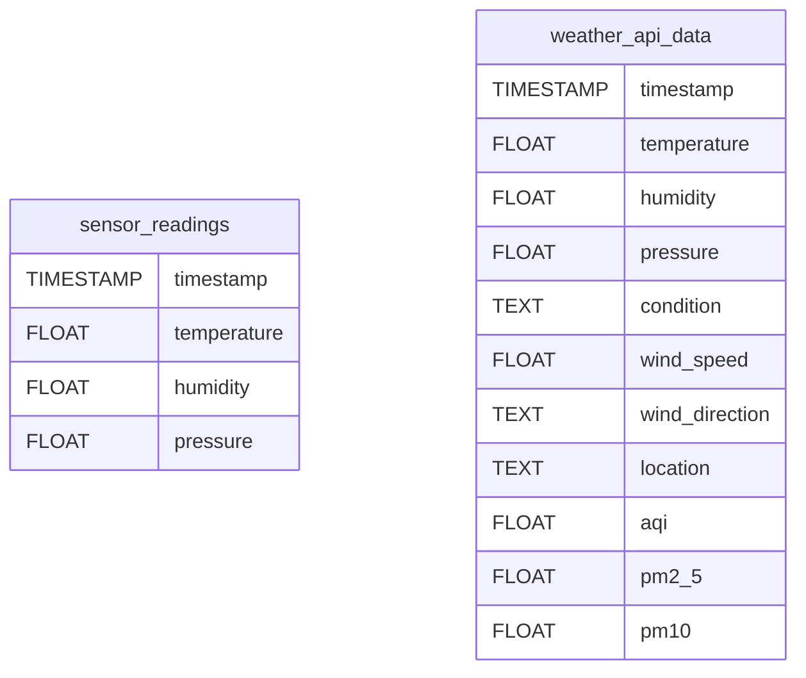

# Raspberry Pi Data Pipeline

A distributed system for collecting and visualizing environmental sensor data.

## Project Overview

### Core Components
| Service | Description | Port | Key Files |
|---------|-------------|------|-----------|
| **Sensor Collector** (`sensor_collector/`) | Collects Sense HAT metrics (temperature, humidity, pressure) | - | `Dockerfile`, `sensor_collector_host.py`, `sensor-test.py` |
| **Weather Collector** (`weather_collector/`) | Fetches weather data from WeatherAPI.com | - | `Dockerfile`, `weather_collector.py`, `requirements.txt` |
| **PostgreSQL** (`database/`) | Time-series data storage | 5432 | `init.sql` |
| **Dashboard** (`dashboard/`) | Streamlit visualization interface | 8501 | `app.py`, `Dockerfile` |

## Key Features
- Real-time sensor data collection from Raspberry Pi Sense HAT
- Environmental weather data integration via WeatherAPI.com
- Interactive Streamlit dashboard with data comparison
- Docker-based deployment with compose orchestration
- PostgreSQL database with optimized sensor data schema

## Getting Started

### Prerequisites
- Docker Engine 20.10+
- Docker Compose 2.20+
- Python 3.9+
- WeatherAPI.com account (free tier)

### Installation
1. Clone repository:
```bash
git clone https://github.com/your-username/raspberry-pi-data-pipeline.git
cd raspberry-pi-data-pipeline
```

2. Configure environment:
```bash
cp .env.example .env
nano .env  # Add your WeatherAPI key (WEATHER_API_KEY)
```

3. Start services:
```bash
docker-compose up --build -d
```

## Operational Guide

### Service Management
| Command | Description |
|---------|-------------|
| `docker-compose up -d` | Start all services |
| `docker-compose logs -f` | View live service logs |
| `docker-compose exec sensor-collector bash` | Access sensor container |
| `docker-compose down -v` | Stop and remove all containers |

### Data Collection
- Sensor data: Collected every 30 seconds via Sense HAT
- Weather data: Collected every 5 minutes from WeatherAPI.com
- Data retention: Configured via PostgreSQL table partitioning

### Dashboard Features
- Real-time sensor vs weather data comparison
- Historical data visualization (1h/24h/7d)
- Air quality index (AQI) monitoring
- Raw data inspection tables

## Database Schema Overview


## Development Setup

### Testing Sensor Integration
```bash
docker-compose exec sensor-collector python sensor-test.py
```

### Monitoring Data Flow
```bash
# View sensor data stream
docker-compose exec postgres psql -U postgres -d sensordata -c "SELECT * FROM sensor_readings ORDER BY timestamp DESC LIMIT 10;"

# View weather data
docker-compose exec postgres psql -U postgres -d sensordata -c "SELECT timestamp,temperature,humidity FROM weather_api_data ORDER BY timestamp DESC LIMIT 5;"
```

### Debugging Tips
1. Verify Sense HAT detection:
```bash
docker-compose exec sensor-collector python -c "from sense_hat import SenseHat; print(SenseHat().get_temperature())"
```

2. Test weather API connection:
```bash
docker-compose exec weather-collector python -c "import os; print('API Key:', os.getenv('WEATHER_API_KEY'))"
```

## Configuration Reference

### Environment Variables
| Variable | Service | Description |
|----------|---------|-------------|
| `WEATHER_API_KEY` | Weather Collector | WeatherAPI.com authentication key |
| `WEATHER_CITY` | Weather Collector | Location for weather data collection |
| `DB_*` | All | PostgreSQL connection parameters |

### Port Mapping
| Service | Host Port | Container Port |
|---------|-----------|----------------|
| Postgres | 5432 | 5432 |
| Dashboard | 8501 | 8501 |
